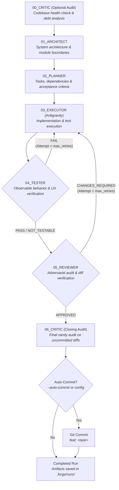

# Forge

**CLI-First Multi-Agent Orchestration Framework for Autonomous, Auditable Software Development.**

Forge coordinates local AI coding agents into a structured, role-driven engineering pipeline. Operating directly through installed developer CLI binaries—primarily **OpenCode**, **Google Antigravity** (`agy`), and **OpenAI Codex** (`codex`)—Forge enforces separation of concerns across software architecture, project planning, code implementation, adversarial review, and codebase health auditing without cloud API vendor lock-in or token markups.

---

## Features

- **Multi-Agent Pipeline**: Structured engineering lifecycle across specialized roles: **Critic** (`00`) → **Architect** (`01`) → **Planner** (`02`) → **Executor** (`03`) → **Tester** (`04`) → **Reviewer** (`05`) → **Critic** (`06`). A single authoritative source of truth (`StageOrder`) drives both interactive and autonomous execution without magic sequence constants.
- **Codebase Critic**: Relentlessly audits codebases or targeted modules for architectural decay, tight coupling, code smells, performance bottlenecks, and security vulnerabilities. Explicitly distinguishes between pre-run audit (`00_critic`, `phase: pre_run`) and closing post-execution audit (`06_critic`, `phase: post_run`).
- **Software Architect**: Translates user requirements and audit findings into formal system designs, module boundaries, interfaces, refactoring mandates, and architectural decision records (ADRs) without touching implementation code.
- **Project Planner**: Converts approved architecture specifications into dependency-ordered tasks, explicit acceptance criteria, and validation requirements without redesigning architecture or writing code.
- **Software Executor**: Implements the approved plan directly within the codebase (powered by **Google Antigravity** / `agy` or **OpenAI Codex**), runs formatters, linters, builds, and automated test suites, and reports concrete execution evidence.
- **Empirical Black-Box Tester**: Operates running applications through native public interfaces (Headless Chromium via Playwright, REST/GraphQL APIs, CLI binaries, Library imports) under process group supervision (`RuntimeSupervisor`). Enforces strict resource budgets (`TestingBudget`), prioritizes modified features, detects dead interactions, unhandled console exceptions, and network errors, and collects forensic evidence (viewport screenshots, telemetry, and standalone executable reproduction scripts).
- **Diff-First Adversarial Reviewer**: Change-centric quality gate where the Git diff is the primary review artifact. Receives the complete Tester report (`04_tester.md` and `04_tester.json`) as concrete behavioral evidence alongside Original Requirements → Executor Report → Git Status → Changed Files → Git Diff → Repository Access. Directly verifies Executor claims against actual repository changes and rejects unsubstantiated claims.
- **Autonomous Repair Loop**: In `forge auto`, automatically iterates through the verification gate (Tester → Reviewer). If the Tester reports `FAIL` or the Reviewer requests changes (`CHANGES_REQUIRED`), structured feedback is fed back into subsequent Executor attempts until full approval is achieved or `--max-retries` is reached.
- **Resume & Checkpoint Support**: Resumes previous runs seamlessly via `--run <run_id>`. Automatically detects and skips already completed or approved stages to enable idempotent recovery from transient failures or user pauses.
- **Run History & Telemetry**: Every run is sequentially numbered (`run-001`, `run-002`, ...) and saved under `.forge/runs/`. Inspect historical runs, statuses, timestamps, and active adapters with `forge runs` (supports text table and JSON formats).
- **Git Native Integration**: Captures unified diffs of staged, unstaged, and untracked files (diffed against `/dev/null`). Safely filters `.forge/` runtime data and `.env*` secrets from diffs, staging, and automated commits.
- **Configurable CLI Adapters**: First-class support for `opencode`, `antigravity` (`agy`), and `codex` adapters with per-stage model selection, reasoning effort tiers (`effort: high`), tool auto-approval (`auto_approve`), and custom CLI flags (`extra_flags`). Supports phase-aware `post_run_override` for post-execution audits.
- **Strict Protocol Validation**: Every agent must emit a standardized YAML machine report. Forge parses, validates allowed statuses and handoffs, captures structured issues, and halts execution immediately upon protocol violations or non-success statuses.
- **Atomic Artifact Storage & Exclusive Run Ownership**: Paired human-readable (`.md`) and machine-readable (`.json`) artifacts are written atomically using temporary files and filesystem renames. OS-level exclusive run locking (`RunLock`) backed by kernel `flock` prevents concurrent execution conflicts with automatic stale-lock recovery. Every prompt is tagged with a SHA-256 hash.

---

## Installation

Forge is distributed as a standard Python package (`forge-orchestrator`).

### Requirements

- **Python**: `>= 3.10`
- **Git**: Installed and accessible in your `PATH`
- **Supported CLI Tools**:
  - **OpenCode** (`opencode`): Default adapter for Critic, Architect, Planner, and Reviewer.
  - **Google Antigravity** (`agy` or `antigravity`): Default adapter for Executor.
  - **OpenAI Codex** (`codex`): First-class adapter for execution, architecture, review, or custom pipelines.
- **Optional CLI Tools**: Detected by `forge doctor` (e.g., `claude`, `aider`, `gemini`).

### Editable Installation

Clone the repository and install Forge in editable mode with development dependencies:

```bash
git clone https://github.com/your-repo/forge.git
cd forge
pip install -e ".[dev]"
```

Verify the installation and CLI entrypoint:

```bash
forge --version
```

Run diagnostics to verify your environment and installed CLI tools:

```bash
forge doctor
```

---

## Quick Start

```bash
# 1. Verify installed CLI tools, git state, and stage configurations
forge doctor

# 2. Initialize prompt templates (.ai/) and forge.yaml in your repository
forge init

# 3. Perform a standalone architectural and security audit
forge critic "Audit authentication system and token validation"

# 4. Run standard pipeline with interactive confirmation between stages
forge run "Implement JWT authentication with refresh token rotation"

# 5. Run fully autonomous self-repair loop with automatic git commit
forge auto "Create REST API endpoints for user profiles" --auto-commit
```

---

## CLI Commands

Forge exposes 11 dedicated commands. Every command and option is verified against `src/forge/cli.py`.

### 1. `forge doctor`
Diagnoses installed CLI binaries (`opencode`, `agy`/`antigravity`, `claude`, `aider`, `gemini`), git repository status, active branch, `.ai/` prompt template availability, and configured stages.

```bash
forge doctor
```

### 2. `forge init`
Initializes Forge in the current directory:
- Installs 6 default role templates in `.ai/roles/` (`architect.md`, `planner.md`, `executor.md`, `tester.md`, `reviewer.md`, `critic.md`).
- Installs the common agent machine protocol in `.ai/templates/protocol.md`.
- Installs starter project documentation in `.ai/project/` (`architecture.md`, `conventions.md`, `decisions.md`, `roadmap.md`).
- Creates or updates `.gitignore` to prevent tracking `.forge/runs/` and `.forge/cache/`.
- Creates `forge.yaml` if not already present.

```bash
forge init
```

### 3. `forge runs`
Lists historical runs stored in `.forge/runs/`, including run ID, creation timestamp (UTC), final status, task summary, and adapters used.

**Options**:
- `-n, --limit INTEGER`: Number of recent runs to display (default: `10`).
- `-j, --json-output`: Output runs list as formatted JSON.

**Examples**:
```bash
forge runs
forge runs -n 25
forge runs --json-output
```

### 4. `forge critic`
Runs the standalone **Critic** role (Sequence `00`) to audit and expose architectural flaws, security risks, code smells, and technical debt in the codebase or a specified target.

**Arguments**:
- `[TARGET]`: Optional scope or focus area. Defaults to `"Audit and critique the codebase for architecture, security, code smells, and maintainability."`.

**Examples**:
```bash
forge critic
forge critic "Audit error handling and resource leaks in src/forge/adapters/"
```

### 5. `forge architect`
Runs the **Architect** role (Sequence `01`) to generate system architecture, module boundaries, interface definitions, and refactoring guidelines for a specified task. Creates a new run directory.

**Arguments**:
- `TASK`: Required task description.

**Examples**:
```bash
forge architect "Add PostgreSQL connection pooling and health checks"
```

### 6. `forge planner`
Runs the **Planner** role (Sequence `02`) to decompose approved architecture into an ordered task breakdown with acceptance criteria and validation requirements.

**Options**:
- `--run TEXT`: Existing Run ID to execute Planner on (defaults to the latest run).

**Prerequisite**: The target run must contain an existing Architect artifact (`01_architect.md` or `.json`).

**Examples**:
```bash
forge planner
forge planner --run run-019
```

### 7. `forge execute`
Runs the **Executor** role (Sequence `03`, powered by Antigravity / `agy`) to implement the approved plan directly in the codebase and run validation tests.

> [!NOTE]
> The CLI command is `forge execute` (which invokes the `executor` role).

**Options**:
- `--run TEXT`: Existing Run ID to execute Executor on (defaults to the latest run).

**Prerequisite**: The target run must contain an existing Planner artifact (`02_planner.md` or `.json`).

**Examples**:
```bash
forge execute
forge execute --run run-019
```

### 8. `forge test`
Runs the **Tester** role (Sequence `04`) to evaluate observable software behavior through empirical black-box testing. Launches application processes, operates native interfaces (Web via Playwright, API, CLI, Library), captures screenshots and unhandled client exceptions, generates standalone reproduction scripts in `.forge/runs/<run_id>/evidence/`, and issues an empirical verdict (`PASS`, `FAIL`, `BLOCKED`, `NOT_TESTABLE`).

**Options**:
- `--run TEXT`: Existing Run ID to execute Tester on (defaults to the latest run).

**Prerequisite**: The target run must contain an existing Executor artifact (`03_executor.md` or `.json`).

**Examples**:
```bash
forge test
forge test --run run-019
```

### 9. `forge review`
Runs the **Reviewer** role (Sequence `05`) to perform a change-centric, diff-first adversarial audit. The Reviewer receives the complete Tester report (`04_tester.md` and `04_tester.json`), original requirements, Executor report, Git status, changed-file summary, bounded Git diff, and repository access to verify all claims against actual codebase changes.

**Options**:
- `--run TEXT`: Existing Run ID to execute Reviewer on (defaults to the latest run).

**Prerequisite**: The target run must contain an existing Executor artifact (`03_executor.md` or `.json`).

**Examples**:
```bash
forge review
forge review --run run-019
```

### 10. `forge run`
Runs the standard multi-agent pipeline with step-by-step confirmation checkpoints between stages (`Architect` → `Planner` → `Executor` → `Tester` → `Reviewer` [→ `Critic`]). Prompts `Proceed to next stage (NEXT)? [Y/n]` after each successful stage. If paused by the user, the run status is saved as `PAUSED_AFTER_<STAGE>`.

**Arguments**:
- `[TASK]`: Task description (required unless `-c/--from-critic` or `--run` is used).

**Options**:
- `-c, --from-critic`: Automatically resume from the latest Critic audit report (creates a new linked run inheriting Critic findings as `00_critic`).
- `--run TEXT`: Existing Run ID to resume from. Automatically skips already completed stages if resuming the same task.
- `--no-critic`: Skip the final post-execution codebase health audit.

**Examples**:
```bash
forge run "Add OAuth2 GitHub login"
forge run --from-critic
forge run --run run-019
forge run "Quick bugfix" --no-critic
```

### 11. `forge auto`
Runs the fully autonomous, unattended self-repair loop: `Architect` → `Planner` → `[Executor <-> (Tester -> Reviewer) Self-Repair Loop]` → `Critic`. If the Tester reports `FAIL` or the Reviewer requests changes (`CHANGES_REQUIRED`), structured issues are fed back into the Executor prompt for up to `--max-retries` iterations.

**Arguments**:
- `[TASK]`: Task description (can be supplied as argument, via `-f`, or via `-c`).

**Options**:
- `-f, --file FILE`: Path to markdown requirements or specification file.
- `-c, --from-critic`: Automatically resume from the latest Critic audit report.
- `--run TEXT`: Existing Run ID to resume from. Automatically skips approved stages.
- `-r, --max-retries INTEGER RANGE`: Maximum auto-repair iterations between Executor and verifiers (default: `3`, minimum: `1`).
- `--auto-commit`: Automatically commit changes to git (`feat: <task>`) upon approved review, executed after the closing Critic audit passes.
- `--no-critic`: Skip the final post-execution codebase health audit.

**Examples**:
```bash
forge auto "Implement Redis caching for user sessions"
forge auto -f specs/rate_limiting.md --max-retries 5 --auto-commit
forge auto --from-critic --auto-commit
forge auto --run run-020
```

---

## Configuration

Forge utilizes a cascading configuration hierarchy. Configuration files are loaded and merged in the following order (later sources override earlier ones):

1. **Built-in Defaults**: Hardcoded in `Config.default()`.
2. **Global User Configuration**: `~/.forge/config.yaml`.
3. **Project Configuration**: `./forge.yaml` in the project root.
4. **Local Workspace Configuration**: `./.forge/config.yaml` in the project root.

### Example `forge.yaml`

```yaml
version: "1.0"

stages:
  critic:
    adapter: opencode
    model: null             # Uses adapter default (or specify model alias)
    effort: null
    auto_approve: false
    post_run_override:      # Phase-aware override for closing audit (06_critic)
      adapter: opencode
      model: gemini-2.5-pro

  architect:
    adapter: opencode
    model: null
    effort: null
    auto_approve: false

  planner:
    adapter: opencode
    model: null
    effort: null
    auto_approve: false

  executor:
    adapter: antigravity
    model: gemini-3.7-flash-high
    effort: high
    auto_approve: false     # Set true to grant permission to execute commands without prompt
    extra_flags:
      print-timeout: 600s

  tester:
    adapter: opencode
    model: null
    effort: null
    auto_approve: false

  reviewer:
    adapter: opencode
    model: null
    effort: null
    auto_approve: false

execution:
  mode: interactive         # "interactive" or "autonomous"
  auto_commit: false        # Commit changes upon approved review
  timeout: 300              # Global execution timeout in seconds
```

### Configuration Keys & Defaults

| Section | Key | Type | Default | Description |
| :--- | :--- | :--- | :--- | :--- |
| **Top-Level** | `version` | `str` | `"1.0"` | Configuration schema version |
| **`execution`** | `mode` | `str` | `"interactive"` | Default execution mode (`"interactive"` or `"autonomous"`) |
| | `auto_commit` | `bool` | `false` | Automatically commit code on approved review |
| | `timeout` | `int` | `300` | Stage execution timeout (absolute hard ceiling in seconds) |
| | `idle_timeout` | `int/float?` | `null` | Idle timeout resetting on progress (e.g. chunks, tool calls) |
| **`stages.<role>`** | `adapter` | `str` | `"opencode"` (`"antigravity"` for executor) | CLI adapter to invoke (`"opencode"`, `"antigravity"`, `"agy"`) |
| | `model` | `str?` | `null` (`"gemini-3.7-flash-high"` for executor) | Model identifier passed via CLI flag |
| | `effort` | `str?` | `null` (`"high"` for executor) | Reasoning effort (`--variant` for opencode, `--effort` for antigravity) |
| | `timeout` | `int?` | `null` | Per-stage absolute timeout override |
| | `idle_timeout` | `int/float?` | `null` | Per-stage idle progress timeout override |
| | `auto_approve` | `bool` | `false` | Grants automatic permission (`--auto` for opencode, `--dangerously-skip-permissions` for antigravity) |
| | `extra_flags` | `dict` | `{}` | Additional CLI flags rendered as `--<key> <value>` |
| | `post_run_override` | `dict?` | `null` | Phase-aware override applied exclusively to post-execution Critic (Stage 06) |

> [!WARNING]
> Setting `auto_approve: true` permits CLI agents to modify code, run arbitrary shell commands, and execute tests without human confirmation. Forge prints a visible security warning whenever `auto_approve` is active.

---

## Pipeline Lifecycle



### Stage Transitions & Handoffs

1. **Critic (Sequence 00)**: Pre-run audit. Emits `CRITIQUE_COMPLETE` with handoff `ARCHITECT`.
2. **Architect (Sequence 01)**: Reviews requirements, conventions, and project docs. Emits `APPROVED` with handoff `PLANNER`.
3. **Planner (Sequence 02)**: Converts architecture into task breakdown. Emits `READY` with handoff `EXECUTOR`.
4. **Executor (Sequence 03)**: Implements code changes and runs tests. Emits `SUCCESS` with handoff `TESTER`.
5. **Tester (Sequence 04)**: Evaluates runtime behavior, interactive states, and user journeys.
   - If behavioral defects found and retries remain: Emits `FAIL` with handoff `EXECUTOR`.
   - If acceptable: Emits `PASS` with handoff `REVIEWER`.
   - If non-runnable/docs change: Emits `NOT_TESTABLE` with handoff `REVIEWER`.
6. **Reviewer (Sequence 05)**: Scrutinizes diffs and concrete behavioral evidence from the Tester report.
   - If implementation defects detected and retries remain: Emits `CHANGES_REQUIRED` with handoff `EXECUTOR`.
   - If acceptable: Emits `APPROVED` with handoff `NONE`.
7. **Closing Critic (Sequence 06)**: Final verification of the modified codebase before commits are finalized. Emits `CRITIQUE_COMPLETE`.

### Protocol Validation

Agents must output their verdict in a standardized YAML machine block:

```yaml
```yaml
ROLE: ARCHITECT
STATUS: APPROVED
HANDOFF: PLANNER
EXIT_CODE: 0
REASON: Architecture approved; modular boundaries respected.
CONFIDENCE: HIGH
NEXT_ACTION: Planner decomposes work into tasks.
ISSUES:
  CRITICAL: []
  MAJOR: []
  MINOR: []
```
```

Forge validates that:
1. `ROLE` matches the expected stage name.
2. `STATUS` is in the role's allowed status set (e.g., `APPROVED`, `READY`, `SUCCESS`).
3. `HANDOFF` points to an allowed downstream role.
4. Non-success statuses (`REJECTED`, `BLOCKED`, `FAILED`, `CHANGES_REQUIRED`, `UNKNOWN`) halt execution immediately.

---

## Run Artifacts & Storage

All execution state is stored within the `.forge/` directory in your project root.

```text
.forge/
├── runs/
│   ├── run-001/
│   │   ├── metadata.json                 # Run status, task, timestamps, prompt hashes, adapters
│   │   ├── 00_critic.md                  # Pre-run human-readable audit report
│   │   ├── 00_critic.json                # Pre-run typed machine report
│   │   ├── 01_architect.md               # Architecture design document
│   │   ├── 01_architect.json             # Architecture machine report
│   │   ├── 02_planner.md                 # Implementation task plan
│   │   ├── 02_planner.json               # Planner machine report
│   │   ├── 03_executor.md                # Executor implementation evidence & test output
│   │   ├── 03_executor.json              # Executor machine report
│   │   ├── 03_executor_attempt_1.md      # Historical executor attempt 1 (in auto loop)
│   │   ├── 03_executor_attempt_1.json    # Historical executor attempt 1 report
│   │   ├── 04_reviewer.md                # Reviewer adversarial review scorecard
│   │   ├── 04_reviewer.json              # Reviewer machine report
│   │   ├── 04_reviewer_attempt_1.md      # Historical reviewer attempt 1
│   │   ├── 04_reviewer_attempt_1.json    # Historical reviewer attempt 1 report
│   │   ├── 05_critic.md                  # Post-execution fresh codebase health audit
│   │   └── 05_critic.json                # Post-execution machine report
│   └── run-002/
└── cache/                                # Ignored runtime cache
```

### Atomic Storage Guarantees

- **Directory Creation**: Runs are created in isolated `.tmp_run_*` directories and atomically renamed to `run-XXX`.
- **Artifact Writes**: `.md` and `.json` files are written to unique temp files before atomic replacement (`replace`), eliminating race conditions and partial writes.
- **Path Traversal Protection**: Run IDs are strictly validated against `^run-(\d+)$` to prevent path traversal vulnerabilities.

---

## Resuming Runs

Forge provides comprehensive resume semantics across interactive and autonomous modes.

### Resuming an Interactive Run
```bash
# Resume an existing run by ID (or omit ID to resume latest):
forge run --run run-019
```
- **Completed Stage Skipping**: If resuming the same task, Forge checks previously saved stage JSON files. Stages with statuses `APPROVED`, `READY`, `SUCCESS`, `CRITIQUE_COMPLETE`, `COMPLETED`, or `PASSED` are skipped automatically.
- **Task Updating**: If a new task description is passed along with `--run <run_id>`, Forge updates the run task and re-executes stages.

### Resuming an Autonomous Run
```bash
# Resume autonomous loop from the latest checkpoint:
forge auto --run run-019 --max-retries 3
```
- Skips `Architect` if previously `APPROVED` or `READY`.
- Skips `Planner` if previously `APPROVED` or `READY`.
- Skips `Executor` and `Reviewer` if Reviewer previously reached `APPROVED`.

### Resuming from a Critic Audit
```bash
# Start a new pipeline linked to the latest Critic findings:
forge run --from-critic
forge auto --from-critic --auto-commit
```
Forge extracts the Critic markdown and JSON reports from the previous run, creates a new run, stores them as Sequence `00`, and sets the task to address the identified issues.

---

## Realistic Workflows

### 1. New Feature Implementation (Human-in-the-Loop)
```bash
# Run standard pipeline with step-by-step confirmation checkpoints
forge run "Add rate limiting middleware using token bucket algorithm"
```

### 2. Standalone Codebase & Security Audit
```bash
# Run Critic on a specific directory
forge critic "Audit authentication modules for OWASP Top 10 vulnerabilities"
```

### 3. Continuous Autonomous Self-Improvement
```bash
# Step 1: Run audit
forge critic "Audit database transaction isolation and connection pooling"

# Step 2: Automatically implement and verify all fixes
forge auto -c -r 3 --auto-commit
```

### 4. Specification-Driven Implementation
```bash
# Feed a detailed product requirements document (PRD) to Forge
forge auto --file specs/webhook_system.md --max-retries 4 --auto-commit
```

### 5. Resuming Interrupted Work
```bash
# Check historical run IDs
forge runs -n 5

# Resume execution of run-023
forge auto --run run-023
```

---

## Further Documentation

For in-depth architectural details, protocol schemas, adapter configuration, troubleshooting, and developer guides, refer to the [Complete User Guide](docs/USER_GUIDE.md).

## License

Forge is licensed under the [MIT License](LICENSE).
