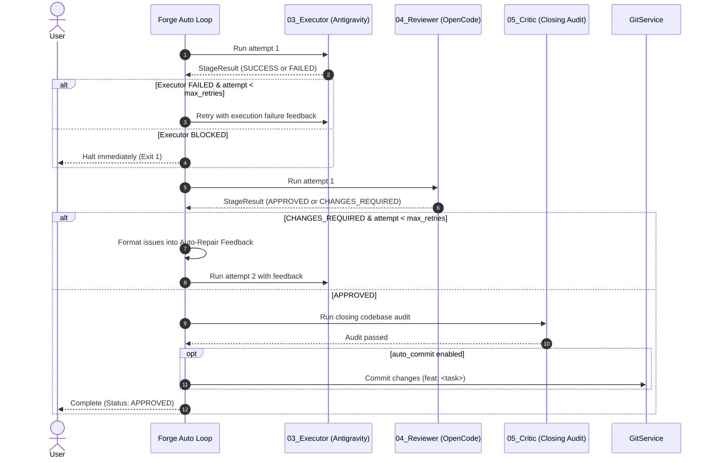

# Forge User Guide & Technical Manual

Welcome to the definitive user manual and technical reference for **Forge**, the CLI-first multi-agent orchestration framework. This guide details Forge's architectural internals, pipeline lifecycle, machine protocol, configuration system, command-line interface, storage layout, git integration, extension points, and release processes.

---

## Table of Contents

1. [Architecture & Pipeline Internals](#1-architecture--pipeline-internals)
   - [Core Design Principles](#core-design-principles)
   - [Component Hierarchy](#component-hierarchy)
   - [Context Budgeting & Prompt Compilation](#context-budgeting--prompt-compilation)
2. [Role Responsibilities](#2-role-responsibilities)
   - [Critic (Auditor)](#critic-auditor)
   - [Architect](#architect)
   - [Planner](#planner)
   - [Executor](#executor)
   - [Reviewer](#reviewer)
3. [Common Agent Protocol v1.0](#3-common-agent-protocol-v10)
   - [Machine Report Schema](#machine-report-schema)
   - [Allowed Statuses & Handoffs](#allowed-statuses--handoffs)
   - [Protocol Extraction & Fallback Parser](#protocol-extraction--fallback-parser)
4. [Configuration Reference (`forge.yaml`)](#4-configuration-reference-forgeyaml)
   - [Loading Priority & Hierarchy](#loading-priority--hierarchy)
   - [Complete Schema & Default Values](#complete-schema--default-values)
   - [Boolean Coercion Rules](#boolean-coercion-rules)
   - [Phase-Aware Critic Overrides (`post_run_override`)](#phase-aware-critic-overrides-post_run_override)
   - [Custom CLI Flags (`extra_flags`)](#custom-cli-flags-extra_flags)
5. [Complete CLI Command & Flag Reference](#5-complete-cli-command--flag-reference)
   - [`forge doctor`](#forge-doctor)
   - [`forge init`](#forge-init)
   - [`forge runs`](#forge-runs)
   - [`forge critic`](#forge-critic)
   - [`forge architect`](#forge-architect)
   - [`forge planner`](#forge-planner)
   - [`forge execute`](#forge-execute)
   - [`forge review`](#forge-review)
   - [`forge run`](#forge-run)
   - [`forge auto`](#forge-auto)
6. [Run Storage & Artifact Layout](#6-run-storage--artifact-layout)
   - [Directory Structure](#directory-structure)
   - [Metadata Schema (`metadata.json`)](#metadata-schema-metadatajson)
   - [Stage Artifact Schema (`XX_role.json`)](#stage-artifact-schema-xx_rolejson)
   - [Attempt Artifacts](#attempt-artifacts)
   - [Atomic Storage Guarantees & Cleanup](#atomic-storage-guarantees--cleanup)
7. [Autonomous Self-Repair & Retry Semantics](#7-autonomous-self-repair--retry-semantics)
   - [Iterative Repair Loop Mechanics](#iterative-repair-loop-mechanics)
   - [Feedback Injection](#feedback-injection)
   - [Halting Conditions](#halting-conditions)
8. [Git Integration & Safety](#8-git-integration--safety)
   - [Diff Generation & Untracked Files](#diff-generation--untracked-files)
   - [Protected Paths & Secret Filtering](#protected-paths--secret-filtering)
   - [Automatic Commits](#automatic-commits)
9. [Resume Semantics](#9-resume-semantics)
   - [Stage Skipping Conditions](#stage-skipping-conditions)
   - [Resuming with Modified Tasks](#resuming-with-modified-tasks)
   - [Resuming from Critic Audits](#resuming-from-critic-audits)
10. [Adapter Configuration & CLI Tools](#10-adapter-configuration--cli-tools)
    - [OpenCode Adapter](#opencode-adapter)
    - [Antigravity Adapter](#antigravity-adapter)
    - [Timeouts & Error Codes](#timeouts--error-codes)
    - [Security & Auto-Approval](#security--auto-approval)
11. [Troubleshooting & Diagnostics](#11-troubleshooting--diagnostics)
    - [Diagnostic Workflow](#diagnostic-workflow)
    - [Common Failure Scenarios & Remedies](#common-failure-scenarios--remedies)
12. [Extending Forge](#12-extending-forge)
    - [Developing New CLI Adapters](#developing-new-cli-adapters)
    - [Defining Custom Roles & Stages](#defining-custom-roles--stages)
13. [Developer Architecture, Testing & Release](#13-developer-architecture-testing--release)
    - [Test Suite & Verification](#test-suite--verification)
    - [Packaging & Distribution](#packaging--distribution)
    - [Release Process](#release-process)

---

## 1. Architecture & Pipeline Internals

### Core Design Principles

Forge operates according to five foundational architectural constraints:

1. **CLI-First**: Forge invokes installed developer CLI binaries (`opencode`, `agy`/`antigravity`) as subprocesses. It never integrates directly with vendor HTTP/gRPC APIs, preventing vendor lock-in and eliminating proprietary API token markups.
2. **Strict Downward Dependencies**: The dependency hierarchy flows strictly downward:
   $$\text{CLI} \longrightarrow \text{Stages} \longrightarrow \text{Core} \longrightarrow \text{Prompts} \longrightarrow \text{Adapters} \longrightarrow \text{Storage}$$
   Lower-level modules (such as Storage, Adapters, or Prompts) never import higher-level components (such as CLI commands or Stages).
3. **Adversarial Role Separation**: System design, task planning, code generation, and verification are handled by distinct, isolated agent personas. A single model is never permitted to design, implement, and self-review code in an unmonitored loop.
4. **Reproducible Telemetry & Hashing**: Every prompt is hashed with SHA-256 prior to execution. All human-readable output and typed machine protocol data are written to disk under versioned run directories.
5. **Atomic Filesystem Mutations**: State modifications, run directories, and stage artifacts are written using temporary files and atomic filesystem replacements (`os.replace` / `Path.replace`), eliminating race conditions and partially written artifacts.

### Component Hierarchy

```
src/forge/
├── cli.py                  # Click CLI entrypoint, command parsing, interactive loops
├── core/
│   ├── config.py           # Cascading configuration, StageConfig, ExecutionConfig
│   ├── context.py          # Active execution context (Run, Config, GitService, Role)
│   ├── git.py              # Subprocess Git service, diff generation, untracked filtering
│   ├── role.py             # Role metadata container and template resolution
│   ├── run.py              # Run entity and metadata persistence
│   └── templates.py        # Bundled fallback roles, protocol, and forge.yaml templates
├── adapters/
│   ├── base.py             # BaseAdapter abstract class, AdapterResponse, flag rendering
│   ├── opencode.py         # OpenCode CLI wrapper (stdin prompt execution)
│   ├── antigravity.py      # Antigravity CLI wrapper (agy -p execution)
│   └── registry.py         # Tool discovery, adapter factory, doctor checks
├── prompts/
│   ├── instruction.py      # Structured instruction data container
│   ├── builder.py          # InstructionBuilder: context aggregation & char budgeting
│   ├── compiler.py         # PromptCompiler: template assembly & markdown generation
│   └── rendered_prompt.py  # RenderedPrompt container with SHA-256 hash & token counts
├── protocol/
│   ├── report.py           # MachineReport dataclass
│   ├── parser.py           # MachineReportParser: multi-strategy YAML extraction
│   └── validator.py        # MachineReportValidator: status & handoff enforcement
├── stages/
│   ├── stage.py            # Generic Stage execution engine (prepare -> execute -> validate -> save)
│   └── result.py           # StageResult container
└── storage/
    └── run_manager.py      # Sequential run-XXX directory management, atomic artifact storage
```

### Context Budgeting & Prompt Compilation

LLM context windows are easily exhausted by runaway git diffs or massive project documentation. Forge solves this using an automated budgeting engine in [`InstructionBuilder`](file:///home/mathir14/forge/src/forge/prompts/builder.py):

- **Project Documentation (`.ai/project/*.md`)**: Scanned and loaded alphabetically. Each document is hard-capped at **40,000 characters**. Excess characters are truncated with an explicit warning note.
- **Previous Stage Artifacts**: Scanned from the active run directory. Each prior stage's markdown is hard-capped at **40,000 characters**.
  - **Exclusion Rule**: To prevent prompt explosion during autonomous repair loops, [`InstructionBuilder`](file:///home/mathir14/forge/src/forge/prompts/builder.py) strictly ignores historical attempt files (files matching `_attempt_`) and the current role's own output (`_{role.name}.md`).
- **Git Diffs**: Dynamically generated by [`GitService`](file:///home/mathir14/forge/src/forge/core/git.py) and hard-capped at **60,000 characters**. If a diff exceeds 60,000 characters, it is truncated cleanly with an explicit character omission warning.
- **Changed Files List**: Provided as a concise list of modified and untracked file paths.
- **Protocol Schema**: Appended at the end of the prompt to enforce YAML compliance.

[`PromptCompiler`](file:///home/mathir14/forge/src/forge/prompts/compiler.py) compiles instructions into unified markdown prompts. For standard roles (`Critic`, `Architect`, `Planner`, `Executor`), templates follow the standard document structure:

```text
# ROLE: <ROLE_NAME>
<Role System Template from .ai/roles/<role>.md>

## PROJECT DOCUMENTATION & CONVENTIONS
### <Doc Name>
<Doc Content>

## PREVIOUS STAGE ARTIFACTS
### Output from <Stage Name>
<Previous Stage Markdown>

## GIT DIFF
```diff
<Git Diff Content>
```

## CHANGED FILES
- path/to/file1.py
- path/to/file2.py

## USER TASK REQUEST
<Task Description>

## PROTOCOL REQUIREMENT
<Protocol Schema from .ai/templates/protocol.md>
```

#### Diff-First Reviewer Context Layout
For the **Reviewer**, Forge compiles a change-centric, diff-first prompt specifically designed for adversarial claim verification:

```text
# ROLE: REVIEWER
<Reviewer System Template>

## PROJECT DOCUMENTATION & CONVENTIONS
<Project Architecture & Conventions>

## Original Requirements
<User Task & Acceptance Requirements>

## Executor Report
<Full Output & Claims from Executor>

## Git Status
<Short Status: M, A, D, R, ?? files>

## Changed Files
<Concise Summary of Modified & Added Files>

## Git Diff
```diff
<Bounded Unified Git Diff (including newly created untracked files)>
```

## Review Instructions
<Adversarial Claim Verification Instructions>

## Repository Access
The repository is available for inspection.
Use it when the diff alone is insufficient.

## PROTOCOL REQUIREMENT
<Protocol Schema from .ai/templates/protocol.md>
```

The resulting prompt is converted into a `RenderedPrompt`, which calculates:
- `prompt_hash`: The first 16 hexadecimal characters of `hashlib.sha256(encoded_text).hexdigest()`.
- `size_bytes`: Byte length of UTF-8 encoded text.
- `estimated_tokens`: Approximation using 4 characters per token (`max(1, len(text) // 4)`).

---

## 2. Role Responsibilities

Forge defines 5 distinct engineering roles. Each role is configured with its own mission, concrete responsibilities, explicit prohibitions, and output expectations.

```
┌────────────────────────────────────────────────────────────────────────┐
│                          00_CRITIC (Auditor)                           │
│  Relentlessly audits codebase for code smells, flaws, and tech debt.   │
└───────────────────────────────────┬────────────────────────────────────┘
                                    │
                                    ▼
┌────────────────────────────────────────────────────────────────────────┐
│                         01_ARCHITECT (Design)                          │
│  Owns system architecture, module boundaries, interfaces, and ADRs.    │
└───────────────────────────────────┬────────────────────────────────────┘
                                    │
                                    ▼
┌────────────────────────────────────────────────────────────────────────┐
│                         02_PLANNER (Planning)                          │
│  Deconstructs architecture into tasks, acceptance criteria, and tests. │
└───────────────────────────────────┬────────────────────────────────────┘
                                    │
                                    ▼
┌────────────────────────────────────────────────────────────────────────┐
│                        03_EXECUTOR (Engineering)                       │
│  Implements plan with Antigravity; validates via build, lint, tests.   │
└───────────────────────────────────┬────────────────────────────────────┘
                                    │
                                    ▼
┌────────────────────────────────────────────────────────────────────────┐
│                         04_REVIEWER (Quality)                          │
│  Adversarially scrutinizes diffs, catches defects, and rejects code.   │
└───────────────────────────────────┬────────────────────────────────────┘
                                    │
                                    ▼
┌────────────────────────────────────────────────────────────────────────┐
│                       05_CRITIC (Closing Audit)                        │
│  Verifies fresh codebase state before auto-commit or pipeline close.   │
└────────────────────────────────────────────────────────────────────────┘
```

### Critic (Auditor)
- **Sequence Number**: `00` (pre-run / standalone) or `05` (post-run closing audit).
- **Mission**: Relentlessly audit, critique, and expose flaws, code smells, technical debt, security vulnerabilities, performance bottlenecks, and architectural violations.
- **Responsibilities**:
  - Audit existing code structure, maintainability, and readability.
  - Detect tight coupling, leaky abstractions, and SOLID violations.
  - Spot error-swallowing, missing error handling, and silent failures.
  - Identify race conditions, resource leaks, and unoptimized operations.
  - Prioritize findings by severity (`CRITICAL`, `MAJOR`, `MINOR`).
  - Provide actionable critique for downstream refactoring.
- **Never**: Write implementation code, create feature plans, or sugarcoat weaknesses.
- **Human Report Output**: Executive Summary, Overall Code Health Score (1–10), Critical Issues, Major Issues, Minor Issues, Recommended Refactoring Targets.
- **Machine Report Additions**: `HEALTH_SCORE` (1–10), `ISSUES`, `RECOMMENDED_ACTIONS`.

### Architect
- **Sequence Number**: `01`.
- **Mission**: Protect the long-term health and structural integrity of the repository.
- **Responsibilities**:
  - Define high-level architecture and system topology.
  - Enforce module boundaries and encapsulation.
  - Specify public APIs, classes, and interface contracts.
  - Approve or reject architectural designs.
  - Mandate required refactors before feature work commences.
- **Never**: Write implementation code, decompose daily planning tasks, or violate established project conventions.
- **Human Report Output**: Summary, Architecture Impact, Modules, Interfaces, Risks, Constraints, Required Refactors, Recommendation.
- **Machine Report Additions**: `ARCHITECTURE`, `MODULES`, `NEW_INTERFACES`, `REFACTOR_REQUIRED` (`YES|NO`), `BREAKING_ARCHITECTURE_CHANGE` (`YES|NO`).

### Planner
- **Sequence Number**: `02`.
- **Mission**: Convert approved architecture into an unambiguous, executable work plan.
- **Responsibilities**:
  - Break down architecture specifications into granular, sequential tasks.
  - Explicitly define inter-task dependencies.
  - Define acceptance criteria for every individual task.
  - Specify automated validation requirements (linter, unit tests, integration tests).
- **Never**: Redesign architecture, invent unapproved modules, or write implementation code.
- **Human Report Output**: Summary, Assumptions, Dependencies, Tasks, Acceptance Criteria, Validation, Risks, Recommendation.
- **Machine Report Additions**: `TASK_COUNT`, `TASKS`, `DEPENDENCIES`, `ACCEPTANCE_CRITERIA`, `VALIDATION_REQUIRED`.

### Executor
- **Sequence Number**: `03`.
- **Mission**: Implement the approved plan with complete fidelity and report empirical validation evidence.
- **Default Tool**: Powered by **Google Antigravity** (`agy`).
- **Responsibilities**:
  - Implement changes directly across files in the project.
  - Run build systems, formatters, linters, and unit test suites.
  - Provide concrete evidence of test execution and pass rates.
  - Escalate immediately if an unresolvable architectural conflict or breaking change is encountered.
- **Never**: Alter system architecture without approval, modify unapproved APIs, hide test failures, or skip validation steps.
- **Human Report Output**: Summary, Files Changed, Commands Executed, Validation Evidence, Test Results, Tradeoffs, Remaining Issues.
- **Machine Report Additions**: `VALIDATION`, `ARTIFACTS` (`ARCHITECTURE_CHANGED`, `API_CHANGED`, `DATABASE_SCHEMA_CHANGED`, `NEW_DEPENDENCIES`, `BREAKING_CHANGE`).

### Reviewer
- **Sequence Number**: `04`.
- **Mission**: Act as an adversarial quality gate. Assume the implementation is defective until proven otherwise.
- **Diff-First Architecture**: The Reviewer does not rediscover the repository from scratch; the Git diff is the primary review artifact. The Reviewer receives the original requirements, Executor report, Git status, changed-file summary, bounded Git diff, and repository access.
- **Executor Claim Verification**: Treat the Executor as a change producer and the Reviewer as a verifier. Compare every claim in the Executor report (e.g. bug fixes, added features, new tests, test execution passes) directly against the actual Git diff and repository state. Reject any claim that is not supported by implementation evidence (e.g. ignored timeout arguments, dummy assertions).
- **Responsibilities**:
  - Verify Executor claims against actual Git diff and repository changes.
  - Reject weak, broken, or unsubstantiated implementations.
  - Verify complete compliance with the approved architecture and plan.
  - Scrutinize unified git diffs for subtle logic bugs, race conditions, and regressions.
  - Identify security vulnerabilities, unhandled exceptions, and memory leaks.
  - Verify comprehensive test coverage for edge cases and failure modes.
  - Score the implementation across 6 quality axes (1–10).
  - Issue an unambiguous verdict: `APPROVED` or `CHANGES_REQUIRED`.
- **Never**: Trust Executor claims without verifying against actual Git changes, rewrite implementation code, silently patch issues, or accept unvalidated code.
- **Human Report Output**: Executive Summary, Critical Issues, Major Issues, Minor Issues, Strengths, Review Scores, Approval Decision.
- **Machine Report Additions**: `SCORES` (`ARCHITECTURE`, `MAINTAINABILITY`, `READABILITY`, `SECURITY`, `PERFORMANCE`, `TESTING`), `APPROVAL` (`YES|NO`).

---

## 3. Common Agent Protocol v1.0

Every agent executing within Forge must conclude its response with a standardized YAML machine block. This protocol allows Forge's runtime to programmatically extract status, determine stage handoffs, record execution metrics, and trigger automated repair loops.

### Machine Report Schema

```yaml
```yaml
ROLE: ARCHITECT               # Stage name (CRITIC, ARCHITECT, PLANNER, EXECUTOR, REVIEWER)
PROMPT_VERSION: 1.0           # Protocol version
TASK_ID: run-019              # Active Run ID

START_TIME: "2026-09-17T10:00:00Z"
END_TIME: "2026-09-17T10:01:30Z"
DURATION: 90.0

STATUS: APPROVED              # Stage status
EXIT_CODE: 0                  # Execution exit code (0 for success)
HANDOFF: PLANNER              # Next expected role or NONE
REASON: "Architecture approved with modular isolation."

INPUTS:
  TASK: "Implement OAuth2 login"
OUTPUTS:
  SPEC: ".forge/runs/run-019/01_architect.md"

ISSUES:
  CRITICAL: []
  MAJOR: []
  MINOR:
    - "Consider adding OpenID Connect claims in future refactor"

CONFIDENCE: HIGH
NEXT_ACTION: "Planner decomposes approved modules into implementation tasks."
```
```

### Allowed Statuses & Handoffs

Forge strictly enforces permitted statuses and handoff transitions per role via [`MachineReportValidator`](file:///home/mathir14/forge/src/forge/protocol/validator.py):

| Role | Allowed `STATUS` Values | Allowed `HANDOFF` Values |
| :--- | :--- | :--- |
| **`CRITIC`** | `CRITIQUE_COMPLETE`, `COMPLETED`, `PASSED`, `APPROVED`, `BLOCKED`, `READY` | `ARCHITECT`, `PLANNER`, `NONE` |
| **`ARCHITECT`** | `APPROVED`, `REJECTED`, `BLOCKED`, `READY` | `PLANNER`, `NONE` |
| **`PLANNER`** | `READY`, `BLOCKED`, `APPROVED`, `REJECTED` | `EXECUTOR`, `ARCHITECT`, `NONE` |
| **`EXECUTOR`** | `SUCCESS`, `FAILED`, `BLOCKED` | `REVIEWER`, `PLANNER`, `ARCHITECT`, `NONE` |
| **`REVIEWER`** | `APPROVED`, `CHANGES_REQUIRED`, `BLOCKED`, `REJECTED` | `NONE`, `EXECUTOR`, `ARCHITECT` |

#### Non-Success Status Handling
If an agent emits an unpermitted status, or if the status is `REJECTED`, `BLOCKED`, `FAILED`, `UNKNOWN`, or `CHANGES_REQUIRED` (outside of an active repair retry), Forge:
1. Marks `result.success = False`.
2. Updates `run.status` to the non-success status.
3. Saves `metadata.json`.
4. Halts CLI execution with an exit code of `1`.

### Protocol Extraction & Fallback Parser

[`MachineReportParser`](file:///home/mathir14/forge/src/forge/protocol/parser.py) employs a 3-tier extraction strategy to ensure reliable extraction even when LLM output formatting varies:

1. **Strict Block Regex**: Searches for explicit fenced YAML blocks containing a `ROLE:` key:
   ```python
   re.compile(r"```ya?ml\s*(?:#.*?\n)?(ROLE:.*?)```", re.DOTALL | re.IGNORECASE)
   ```
2. **Generic YAML Scan**: Iterates through all fenced ```yaml blocks in the text, testing if any block contains keys matching `ROLE`, `STATUS`, or `HANDOFF`.
3. **Unquoted Line Heuristic**: If backticks are omitted, scans top-level lines beginning with `ROLE:` and `STATUS:`, capturing until a markdown heading (`## `) or horizontal rule (`---`) is encountered.

---

## 4. Configuration Reference (`forge.yaml`)

### Loading Priority & Hierarchy

Forge resolves configuration settings by cascading through four tiers. Later sources take precedence:

$$\text{Defaults} \longrightarrow \text{Global } (\sim\text{/.forge/config.yaml}) \longrightarrow \text{Project } (\text{./forge.yaml}) \longrightarrow \text{Local } (\text{./.forge/config.yaml})$$

1. **`Config.default()`**: Hardcoded safe defaults.
2. **`~/.forge/config.yaml`**: User-wide preferences (e.g., preferred default models or API tokens across all projects).
3. **`./forge.yaml`**: Project-level configuration committed to version control.
4. **`./.forge/config.yaml`**: Local developer workspace overrides (ignored by git).

### Complete Schema & Default Values

```yaml
version: "1.0"

# Configuration for individual pipeline stages
stages:
  critic:
    adapter: opencode         # Options: "opencode", "antigravity", "agy"
    model: null               # Model alias or ID (null uses adapter default)
    effort: null              # Reasoning effort level (null uses default)
    auto_approve: false       # Automatically grant execution permissions
    extra_flags: {}           # Additional CLI arguments passed to tool
    post_run_override: null   # StageConfig override for post-execution closing audit

  architect:
    adapter: opencode
    model: null
    effort: null
    auto_approve: false
    extra_flags: {}

  planner:
    adapter: opencode
    model: null
    effort: null
    auto_approve: false
    extra_flags: {}

  executor:
    adapter: antigravity
    model: gemini-3.7-flash-high
    effort: high
    auto_approve: false
    extra_flags: {}

  reviewer:
    adapter: opencode
    model: null
    effort: null
    auto_approve: false
    extra_flags: {}

# Pipeline execution and orchestration settings
execution:
  mode: interactive           # Default mode: "interactive" or "autonomous"
  auto_commit: false          # Automatically git commit upon approved review
  timeout: 300                # Per-stage timeout in seconds (default: 300)
```

### Boolean Coercion Rules

To avoid YAML parsing ambiguities, Forge's configuration loader enforces strict boolean coercion via [`Config._coerce_bool`](file:///home/mathir14/forge/src/forge/core/config.py):
- **Truthy Strings**: `"true"`, `"yes"`, `"1"`, `"on"` (case-insensitive) $\longrightarrow$ `True`
- **Falsy Strings**: `"false"`, `"no"`, `"0"`, `"off"`, `""` (case-insensitive) $\longrightarrow$ `False`
- **Ambiguous Inputs**: Any other string (such as `"maybe"` or `"default"`) raises a `ValueError`, which is logged as a warning while preserving existing configuration.

### Phase-Aware Critic Overrides (`post_run_override`)

To prevent self-grading confirmation bias, you can configure Forge to use one model or adapter for the initial pre-run audit (Stage `00`) and a distinct, independent model or adapter for the closing post-execution audit (Stage `05`):

```yaml
stages:
  critic:
    adapter: opencode
    model: big-pickle
    post_run_override:
      adapter: opencode
      model: gemini-2.5-pro   # Independent model inspects uncommitted diffs
```

#### Field-Level Inheritance
If `post_run_override` omits certain fields (e.g., `effort` or `extra_flags`), Forge automatically inherits the omitted fields from the base `critic` stage configuration.

### Custom CLI Flags (`extra_flags`)

You can pass custom command-line arguments to the underlying agent binary via the `extra_flags` mapping:

```yaml
stages:
  executor:
    adapter: antigravity
    extra_flags:
      max-thinking-tokens: 8192
      log-level: verbose
      dry-run: true
      disable-telemetry: false
```

[`BaseAdapter.render_flags`](file:///home/mathir14/forge/src/forge/adapters/base.py) converts this dictionary into command-line arguments:
- Boolean `true` or `"true"` renders as a flag: `--dry-run`
- Boolean `false` or `null` is completely omitted
- Key-value pairs render sequentially: `--max-thinking-tokens 8192 --log-level verbose`
- Unsafe characters (outside `[a-zA-Z0-9_\-]`) are sanitized and stripped.

---

## 5. Complete CLI Command & Flag Reference

Forge provides 10 dedicated CLI commands. Every command and flag is implemented in [`src/forge/cli.py`](file:///home/mathir14/forge/src/forge/cli.py).

| Command | Purpose | Modifies Code? | Input Source |
| :--- | :--- | :---: | :--- |
| **`forge doctor`** | Diagnose environment, tools, and git | ❌ No | System state |
| **`forge init`** | Initialize templates and `forge.yaml` | ❌ No | Filesystem |
| **`forge runs`** | List historical runs and statuses | ❌ No | `.forge/runs/` |
| **`forge critic`** | Audit codebase for debt and smells (Seq 00) | ❌ No | Optional target arg |
| **`forge architect`**| Design system architecture (Seq 01) | ❌ No | Required task arg |
| **`forge planner`**  | Decompose architecture into tasks (Seq 02) | ❌ No | Prior run artifact |
| **`forge execute`**  | Implement plan with Antigravity (Seq 03) | ✅ Yes | Prior run artifact |
| **`forge review`**   | Adversarially audit diffs (Seq 04) | ❌ No | Prior run artifact |
| **`forge run`**      | Run standard pipeline with checkpoints | ✅ Yes | Task arg / `--from-critic` |
| **`forge auto`**     | Run autonomous self-repair loop | ✅ Yes | Task arg / `-f` / `-c` |

---

### `forge doctor`

Performs end-to-end diagnostics on the host system:
1. Verifies CLI binaries in `PATH`: `OpenCode` (`opencode`), `Antigravity` (`agy`/`antigravity`), `Claude Code` (`claude`), `Aider` (`aider`), `Gemini CLI` (`gemini`).
2. Checks git repository initialization and current working branch.
3. Verifies `.ai/` directory and counts configured role templates.
4. Prints configured stages, adapters, and model mappings from `Config.load()`.

```bash
forge doctor
```

---

### `forge init`

Bootstraps Forge configuration and prompt packs in the current project:
- Creates `.ai/roles/` with 5 bundled roles: `architect.md`, `planner.md`, `executor.md`, `reviewer.md`, `critic.md`.
- Creates `.ai/templates/protocol.md` with the Common Agent Protocol v1.0 schema.
- Creates `.ai/project/` with starter templates: `architecture.md`, `conventions.md`, `decisions.md`, `roadmap.md`.
- Creates or updates `.gitignore` to protect `.forge/runs/` and `.forge/cache/`.
- Generates a default `forge.yaml` if one does not already exist.

```bash
forge init
```

---

### `forge runs`

Displays historical run records stored in `.forge/runs/`.

```bash
forge runs [OPTIONS]
```

**Options**:
- `-n, --limit INTEGER`: Number of recent runs to display (default: `10`). Pass `0` or negative to list all runs.
- `-j, --json-output`: Output runs list as formatted JSON for scripting or CI integration.

**Examples**:
```bash
# View last 10 runs
forge runs

# View last 25 runs
forge runs -n 25

# Output as JSON
forge runs --json-output | jq '.[0]'
```

---

### `forge critic`

Runs the standalone **Critic** role (Sequence `00`) to inspect code quality, architecture violations, and vulnerabilities. Creates a new run directory.

```bash
forge critic [TARGET]
```

**Arguments**:
- `[TARGET]`: Optional target focus area. Defaults to `"Audit and critique the codebase for architecture, security, code smells, and maintainability."`.

**Examples**:
```bash
# Full codebase audit
forge critic

# Targeted module audit
forge critic "Audit error handling and cleanup in src/forge/storage/"
```

---

### `forge architect`

Runs the **Architect** role (Sequence `01`) to generate modular architecture designs and interface contracts. Creates a new run directory.

```bash
forge architect TASK
```

**Arguments**:
- `TASK`: Required task description.

**Examples**:
```bash
forge architect "Design database connection pooling with SQLAlchemy 2.0"
```

---

### `forge planner`

Runs the **Planner** role (Sequence `02`) to convert approved architecture into an ordered task breakdown.

```bash
forge planner [OPTIONS]
```

**Options**:
- `--run TEXT`: Run ID to execute Planner on (defaults to the latest run).

**Prerequisite**: The run must contain an existing Architect artifact (`01_architect.md` or `.json`). If missing, Forge exits with code `1`.

**Examples**:
```bash
# Plan latest run
forge planner

# Plan specific run
forge planner --run run-019
```

---

### `forge execute`

Runs the **Executor** role (Sequence `03`, powered by Antigravity / `agy`) to implement the plan and execute validation commands.

> [!IMPORTANT]
> The CLI command is `forge execute` (which invokes the `executor` role). `forge executor` does not exist.

```bash
forge execute [OPTIONS]
```

**Options**:
- `--run TEXT`: Run ID to execute Executor on (defaults to the latest run).

**Prerequisite**: The run must contain an existing Planner artifact (`02_planner.md` or `.json`).

**Examples**:
```bash
# Execute plan on latest run
forge execute

# Execute plan on specific run
forge execute --run run-019
```

---

### `forge review`

Runs the **Reviewer** role (Sequence `04`) to perform an adversarial audit on the implementation and git diffs.

```bash
forge review [OPTIONS]
```

**Options**:
- `--run TEXT`: Run ID to execute Reviewer on (defaults to the latest run).

**Prerequisite**: The run must contain an existing Executor artifact (`03_executor.md` or `.json`).

**Examples**:
```bash
# Review latest run
forge review

# Review specific run
forge review --run run-019
```

---

### `forge run`

Runs the standard multi-agent pipeline with step-by-step confirmation checkpoints:
$$\text{Architect} \longrightarrow \text{Planner} \longrightarrow \text{Executor} \longrightarrow \text{Reviewer} \longrightarrow \text{Critic}$$

After each stage completes, Forge prompts:
```text
Proceed to next stage (PLANNER)? [Y/n]:
```
If the user declines, the run is saved with status `PAUSED_AFTER_<STAGE>` and execution terminates cleanly.

```bash
forge run [OPTIONS] [TASK]
```

**Arguments**:
- `[TASK]`: Task description (required unless `--from-critic` or `--run` is specified).

**Options**:
- `-c, --from-critic`: Automatically resume from the latest Critic audit report.
- `--run TEXT`: Existing Run ID to resume from. Skips stages that already succeeded.
- `--no-critic`: Skip the closing post-execution Critic health audit (Stage `05`).

**Examples**:
```bash
# Standard interactive execution
forge run "Add JWT authentication"

# Resume an interrupted or paused run
forge run --run run-019

# Resume from Critic audit findings
forge run --from-critic

# Skip final audit for quick iterations
forge run "Fix typo in docstring" --no-critic
```

---

### `forge auto`

Runs the fully autonomous, unattended self-repair loop:
$$\text{Architect} \longrightarrow \text{Planner} \longrightarrow \left[ \text{Executor} \longleftrightarrow \text{Reviewer} \right] \longrightarrow \text{Critic} \longrightarrow \text{Git Commit}$$

```bash
forge auto [OPTIONS] [TASK]
```

**Arguments**:
- `[TASK]`: Task description (can be supplied directly, via `-f`, or via `-c`).

**Options**:
- `-f, --file FILE`: Path to markdown requirements or specification file.
- `-c, --from-critic`: Automatically resume from the latest Critic audit report.
- `--run TEXT`: Existing Run ID to resume from. Skips approved stages.
- `-r, --max-retries INTEGER RANGE`: Maximum auto-repair iterations between Executor and Reviewer (default: `3`, minimum: `1`).
- `--auto-commit`: Automatically git commit code upon approved review (after closing Critic audit passes).
- `--no-critic`: Skip the closing post-execution Critic health audit.

**Examples**:
```bash
# Autonomous feature implementation with 3 retries
forge auto "Implement Redis cache layer"

# Execute from a product requirements document with 5 retries and auto-commit
forge auto -f specs/billing_v2.md -r 5 --auto-commit

# Autonomous remediation of Critic audit findings
forge auto -c -r 3 --auto-commit

# Resume autonomous loop on run-020
forge auto --run run-020
```

---

## 6. Run Storage & Artifact Layout

### Directory Structure

Every task execution creates a sequentially numbered directory under `.forge/runs/`:

```text
.forge/
├── runs/
│   ├── run-001/
│   │   ├── metadata.json
│   │   ├── 00_critic.md
│   │   ├── 00_critic.json
│   │   ├── 01_architect.md
│   │   ├── 01_architect.json
│   │   ├── 02_planner.md
│   │   ├── 02_planner.json
│   │   ├── 03_executor.md
│   │   ├── 03_executor.json
│   │   ├── 03_executor_attempt_1.md       # Preserved attempt history
│   │   ├── 03_executor_attempt_1.json
│   │   ├── 04_reviewer.md
│   │   ├── 04_reviewer.json
│   │   ├── 04_reviewer_attempt_1.md       # Preserved attempt history
│   │   ├── 04_reviewer_attempt_1.json
│   │   ├── 05_critic.md
│   │   └── 05_critic.json
│   ├── run-002/
│   └── ...
└── cache/                                 # Runtime cache (ignored by git)
```

### Metadata Schema (`metadata.json`)

Stored at the root of every run directory:

```json
{
  "run_id": "run-019",
  "task": "playwright integration feasibility into opencode",
  "created_at": "2026-09-16T04:51:46.374882+00:00",
  "status": "APPROVED",
  "prompt_hashes": {
    "architect": "230cff66c510ed4e",
    "planner": "4a1b02c89f2134de",
    "executor": "9d8e7f6a5b4c3d2e",
    "reviewer": "1f2e3d4c5b6a7890"
  },
  "adapters_used": {
    "architect": "opencode",
    "planner": "opencode",
    "executor": "antigravity",
    "reviewer": "opencode"
  },
  "metadata": {}
}
```

### Stage Artifact Schema (`XX_role.json`)

Paired with `XX_role.md`, the JSON artifact stores the machine verdict:

```json
{
  "role": "architect",
  "sequence_number": 1,
  "status": "APPROVED",
  "handoff": "PLANNER",
  "duration_seconds": 45.2,
  "exit_code": 0,
  "prompt_hash": "230cff66c510ed4e",
  "machine_report": {
    "role": "ARCHITECT",
    "status": "APPROVED",
    "handoff": "PLANNER",
    "exit_code": 0,
    "reason": "Modular architecture approved; isolation maintained.",
    "confidence": "HIGH",
    "next_action": "Planner produces task breakdown.",
    "issues": {
      "CRITICAL": [],
      "MAJOR": [],
      "MINOR": ["Ensure SQLite connection pool timeout is configured"]
    },
    "data": {
      "ARCHITECTURE": "Layered repository pattern",
      "MODULES": ["src/forge/storage/db.py"],
      "NEW_INTERFACES": ["DatabasePool"],
      "REFACTOR_REQUIRED": false,
      "BREAKING_ARCHITECTURE_CHANGE": false
    },
    "is_valid": true,
    "validation_errors": []
  }
}
```

### Attempt Artifacts

During autonomous repair loops (`forge auto`), every retry iteration persists historical snapshot files:
- `03_executor_attempt_<N>.md` & `03_executor_attempt_<N>.json`
- `04_reviewer_attempt_<N>.md` & `04_reviewer_attempt_<N>.json`

These files record the evolution of the code across iterations. Forge's prompt compiler explicitly skips `_attempt_` files when compiling subsequent prompts to avoid prompt bloat.

### Atomic Storage Guarantees & Cleanup

[`RunManager`](file:///home/mathir14/forge/src/forge/storage/run_manager.py) enforces strict filesystem guarantees:
- **Atomic Run Allocation**: Creates a unique temp directory (`.tmp_run_<random>`) inside `.forge/runs/`, writes the initial `metadata.json`, and renames the directory atomically to `run-XXX`.
- **Stale Temp Directory Cleanup**: Before allocating a run, scans `.forge/runs/` and purges any orphaned `.tmp_run_*` directories older than **300 seconds** (e.g., from crashed processes). Fresh temp directories belonging to concurrent runs are preserved.
- **Atomic File Writes**: `save_stage_artifacts` writes content to a temporary file in the run directory (`.tmp_<prefix>_md_` / `.tmp_<prefix>_json_`) before using atomic replacement (`Path.replace`) to overwrite the target.
- **Path Traversal Protection**: Run IDs must match `^run-(\d+)$`. [`RunManager._validate_run_id`](file:///home/mathir14/forge/src/forge/storage/run_manager.py) verifies that the resolved target path is strictly contained within `.forge/runs/`.
- **Natural Integer Sorting**: Run directories are parsed by numerical value (`int(group(1))`), correctly sorting runs from `run-001` past `run-999` to `run-1000+`.

---

## 7. Autonomous Self-Repair & Retry Semantics

In `forge auto`, Forge runs an autonomous self-repair loop between the Executor and Reviewer.



### Iterative Repair Loop Mechanics

1. **Execution**: The Executor implements changes and runs tests.
2. **Artifact Preservation**: Forge immediately writes `03_executor_attempt_<iteration>.md` and `.json`.
3. **Execution Failure Recovery**: If the Executor fails with exit code $\ne 0$ or status `FAILED`:
   - If `iteration < max_retries`: Forge appends the execution error and the first 2,000 characters of output to the task prompt:
     ```text
     ### Auto-Repair Feedback from Failed Execution (Attempt <N>):
     Executor exited with status 'FAILED'. Output:
     <truncated error output>
     Fix all failures and complete implementation.
     ```
     Forge immediately retries the Executor without invoking the Reviewer.
   - If `iteration >= max_retries`: Forge halts with exit code `1`.
4. **Review**: If execution succeeds, the Reviewer inspects git diffs.
5. **Reviewer Artifact Preservation**: Forge writes `04_reviewer_attempt_<iteration>.md` and `.json`.
6. **Verdict Evaluation**:
   - **`APPROVED`**: The repair loop terminates successfully.
   - **`CHANGES_REQUIRED`**: If `iteration < max_retries`, Forge extracts all reported issues from `machine_report.issues` (`CRITICAL`, `MAJOR`, `MINOR`), formats them into a feedback markdown block, updates `context.run.task`, and launches iteration $N+1$.
   - **Unapproved on Final Attempt**: If the Reviewer does not approve on the final attempt, Forge sets `run.status = rev_res.status`, saves metadata, and halts with exit code `1`.

### Halting Conditions
- **Blocked State**: If the Executor or Reviewer reports `STATUS: BLOCKED`, Forge halts immediately. It never wastes agent attempts when an external dependency or requirement is blocked.
- **Closing Critic Failure**: If the post-execution Critic (Stage `05`) reports a non-success status (`BLOCKED`, `FAILED`, `REJECTED`, `UNKNOWN`), Forge halts immediately, marks `run.status`, and aborts any configured auto-commit.

---

## 8. Git Integration & Safety

Forge includes built-in git integration via [`GitService`](file:///home/mathir14/forge/src/forge/core/git.py).

### Diff Generation & Untracked Files

When generating diffs for prompts ([`GitService.diff`](file:///home/mathir14/forge/src/forge/core/git.py)):
1. Combines unstaged changes (`git diff`) and staged changes (`git diff --cached`).
2. Scans for untracked files using `git status --porcelain -uall`.
3. Newly created untracked files are diffed against `/dev/null` (`git diff --no-index -- /dev/null <path>`) so downstream agents see the full content of newly authored files.
4. **Untracked File Limits**: Caps untracked file diffs to a maximum of **20 files** and **1 MB per file** to prevent buffer exhaustion on large binary or generated assets.

### Protected Paths & Secret Filtering

Forge enforces strict path filtering to prevent accidental leaks:
- **`.forge/` Exclusion**: The `.forge/` directory and any subpaths are strictly excluded from diff generation, file tracking, staging, and automated commits.
- **Secrets & `.env` Exclusion**: Any file whose path contains a part beginning with `.env` (such as `.env`, `.env.local`, `.env.production`) is completely omitted from diffs and commits.
- **Windows Path Separators**: Normalizes backslashes (`\`) to POSIX forward slashes (`/`) before path evaluation to ensure cross-platform safety.
- **Monorepo / Subdirectory Resolution**: Uses `git rev-parse --show-toplevel` to ensure path calculations remain relative and valid even when Forge is invoked from deep within a subdirectory.

### Automatic Commits

When `--auto-commit` is passed or `execution.auto_commit: true` is configured in `forge.yaml`:
- Commits are executed **only after**:
  1. The Reviewer emits `STATUS: APPROVED`.
  2. The closing Critic audit (Stage `05`) completes successfully.
- Commits are constructed with the message `feat: <task_summary>`.
- If the working tree is clean or git commit fails, Forge logs a warning without crashing.

---

## 9. Resume Semantics

Forge provides intelligent resumption logic across both interactive and autonomous modes.

### Stage Skipping Conditions

When resuming an existing run (`--run <run_id>`) for the **same task**:

#### In Standard Pipeline (`forge run --run <run_id>`)
Forge checks the JSON artifact of each stage. If a stage already completed with any of the following statuses, it is skipped:
$$\text{Status} \in \{\text{"APPROVED"}, \text{"READY"}, \text{"SUCCESS"}, \text{"CRITIQUE\_COMPLETE"}, \text{"COMPLETED"}, \text{"PASSED"}\}$$
Forge prints:
```text
⏭ Skipping Stage: Architect (already completed with status 'APPROVED')
```

#### In Autonomous Mode (`forge auto --run <run_id>`)
- **Architect**: Skipped if prior status is `APPROVED` or `READY`.
- **Planner**: Skipped if prior status is `APPROVED` or `READY`.
- **Executor & Reviewer**: Skipped as a pair if the Reviewer previously reached `APPROVED`.

### Resuming with Modified Tasks
If you pass a new task string while specifying `--run <run_id>`:
```bash
forge run "Updated task requirements" --run run-019
```
Forge detects that the task string differs from `run.task`. It updates `run.task` in `metadata.json`, treats the run as unresumed, and re-executes all stages without skipping.

### Resuming from Critic Audits

The `-c / --from-critic` flag bridges audit results directly into feature execution:
```bash
forge auto --from-critic --auto-commit
```
1. Loads the latest run containing a Critic report (checks sequence `00` or `05`).
2. Creates a **new** sequential run (`run-XXX`).
3. Sets `task = "Fix issues and tech debt identified in Critic audit from <prior_run_id>"` (unless an explicit task was passed).
4. Injects the prior Critic markdown and JSON reports as Sequence `00` in the new run directory.
5. Begins execution from Stage `01_ARCHITECT`, giving the Architect direct visibility into the audit report.

---

## 10. Adapter Configuration & CLI Tools

Forge includes built-in adapters for `opencode` and `antigravity` (`agy`).

### OpenCode Adapter
- **Binary**: `opencode` (located via `shutil.which`).
- **Invocation**: `opencode run`
- **Input Delivery**: Passes the prompt through standard input (`stdin`).
- **Command-Line Arguments**:
  - Model: `-m <model>`
  - Reasoning Effort: `--variant <effort>`
  - Auto-Approval: `--auto`
  - Extra Flags: Rendered from `extra_flags` mapping.
- **Capabilities**:
  - `code_read`, `code_edit`, `shell`, `git`, `structured_output`

### Antigravity Adapter
- **Binary**: `agy` or `antigravity` (located via `shutil.which`).
- **Invocation**: `agy -p <prompt> --output-format text`
- **Defaults**:
  - Default Model: `gemini-3.7-flash-high`
  - Default Effort: `high`
- **Command-Line Arguments**:
  - Model: `--model <model>`
  - Reasoning Effort: `--effort <effort>`
  - Auto-Approval: `--dangerously-skip-permissions`
  - Timeout: `--print-timeout <timeout>s`
  - Extra Flags: Rendered from `extra_flags` mapping.
- **OS Argument Limits (`E2BIG`)**: Handles operating system command-line length limits gracefully, logging a descriptive error if prompt text exceeds OS buffer thresholds.
- **Capabilities**:
  - `code_read`, `code_edit`, `shell`, `git`, `structured_output`, `long_running`

### Codex Adapter
- **Binary**: `codex` (located via `shutil.which`).
- **Installation Requirement**: OpenAI Codex CLI (`npm install -g @openai/codex` or standalone binary).
- **Invocation**: `codex exec --color never -`
- **Input Delivery**: Passes prompt safely through standard input (`stdin`) via trailing `-` argument, avoiding OS command-line buffer limits (`E2BIG`).
- **Defaults**:
  - Default Model: `gpt-5.6-terra`
  - Default Effort: `medium`
- **Command-Line Arguments**:
  - Model: `-m <model>`
  - Reasoning Effort: `-c model_reasoning_effort="<effort>"`
  - Auto-Approval: `--dangerously-bypass-approvals-and-sandbox`
  - Working Directory: `-C <cwd>`
  - Extra Flags: Rendered from `extra_flags` mapping (e.g., `--sandbox workspace-write`).
- **Capabilities**:
  - `code_read`, `code_edit`, `shell`, `git`, `structured_output`, `tool_calling`, `long_running`, `custom_flags`
- **Configuration Example**:
  ```yaml
  defaults:
    adapter: codex
    model: gpt-5.6-terra
    effort: medium

  stages:
    architect:
      adapter: codex
      model: o3-mini
      effort: high
      timeout: 600
    executor:
      adapter: codex
      auto_approve: true
  ```

### Timeouts & Error Codes

Stage execution operates on an event-driven model governed by dual timeout controls:
- **Absolute Timeout**: Maximum total wall-clock time permitted for a stage (default: 300 seconds, configurable via `execution.timeout` or `stages.<role>.timeout` in `forge.yaml`). This serves as an unyielding hard ceiling.
- **Idle Timeout**: Maximum permitted interval without progress (configurable via `stages.<role>.idle_timeout` or defaults in `forge.yaml`). Every progressive event (`CHUNK`, `TOOL_START`, `TOOL_FINISH`, `HEARTBEAT`) resets the idle timer.
- **Event-Driven Completion**: A stage completes strictly upon receiving a genuine terminal event (`COMPLETE` or `ERROR`), or when a timeout deadline expires. Intermediate progress chunks or conversational status updates never trigger premature stage completion.
- **Timeout Expiration & Recovery**: If a timeout is exceeded, child process groups are cleanly terminated, recovered partial stdout/stderr output is preserved in the stage result, and an `AdapterResponse` is recorded with `exit_code: 124`.
- **Keyboard Interrupts (SIGINT)**: If a user presses `Ctrl+C`, the adapter catches the interrupt, records duration, and exits cleanly with `exit_code: 130`.

### Security & Auto-Approval

```yaml
stages:
  executor:
    adapter: antigravity
    auto_approve: true        # Passes --dangerously-skip-permissions
```

> [!CAUTION]
> When `auto_approve: true` is set, CLI tools have permission to author files, delete files, and run arbitrary shell commands without prompting for user confirmation.
>
> Whenever a stage executes with `auto_approve: true`, Forge prints a prominent security alert:
> `⚠️  SECURITY WARNING: auto_approve is ENABLED for this stage. CLI agent has permission to execute commands without confirmation.`

---

## 11. Troubleshooting & Diagnostics

### Diagnostic Workflow

Always begin by running `forge doctor`:

```bash
$ forge doctor

🔨 Forge Doctor — Environment & Tool Diagnostics
==================================================

[CLI Tools]
  ✓ OpenCode       found (/usr/local/bin/opencode)
  ✓ Antigravity    found (/home/user/.local/bin/agy)
  ✗ Claude Code    missing (Anthropic Claude Code CLI)
  ✗ Aider          missing (Aider AI Pair Programmer)
  ✗ Gemini CLI     missing (Gemini CLI tool)

[Git Repository]
  ✓ Git initialized (branch: master)

[Project Setup]
  ✓ .ai/ directory found (5 roles configured)

[Configured Stages]
  • Critic     -> opencode
  • Architect  -> opencode
  • Planner    -> opencode
  • Executor   -> antigravity [model: gemini-3.7-flash-high]
  • Reviewer   -> opencode

==================================================
```

### Common Failure Scenarios & Remedies

#### 1. `Adapter tool '<name>' is not installed or not in PATH`
- **Cause**: The binary for the configured adapter (`opencode` or `agy`/`antigravity`) cannot be located by `shutil.which`.
- **Remedy**: Verify installation of the CLI tool and ensure its parent directory is added to your shell's `PATH`. Run `forge doctor` to confirm discovery.

#### 2. `Pipeline halted at stage 'executor' due to status 'BLOCKED'`
- **Cause**: The agent emitted `STATUS: BLOCKED` because a required external dependency, credential, or prerequisite is missing.
- **Remedy**: Inspect `.forge/runs/<run_id>/03_executor.md` and read the `REASON` field in `.json`. Address the blocking requirement, then resume using `forge run --run <run_id>`.

#### 3. `Execution timed out after 300 seconds (Exit code 124)`
- **Cause**: The CLI agent exceeded the execution timeout while processing a large codebase or running lengthy test suites.
- **Remedy**: Increase the global timeout in `forge.yaml`:
  ```yaml
  execution:
    timeout: 900              # Increase timeout to 15 minutes
  ```

#### 4. `Planner requires prior Architect output. Run 'forge architect' first.`
- **Cause**: You ran `forge planner`, `forge execute`, or `forge review` on a run that does not contain the necessary prerequisite stage artifacts.
- **Remedy**: Run stages sequentially (`forge architect` $\to$ `forge planner` $\to$ `forge execute` $\to$ `forge review`), or run the complete pipeline with `forge run "<task>"`.

#### 5. `Prompt exceeds maximum OS command-line argument length (E2BIG)`
- **Cause**: The compiled prompt exceeds operating system limits for CLI argument strings (primarily affects adapters using argument flags like `-p`).
- **Remedy**: Reduce the size of files in `.ai/project/`, clean up untracked files, or switch the stage adapter to `opencode` (which passes prompts via `stdin`).

---

## 12. Extending Forge

### Developing New CLI Adapters

To integrate a new AI CLI binary (e.g., Claude Code, Aider, or a proprietary internal tool):

#### Step 1: Implement the Adapter Class
Create a new adapter subclassing [`BaseAdapter`](file:///home/mathir14/forge/src/forge/adapters/base.py):

```python
# src/forge/adapters/claude.py
import shutil
import subprocess
import time
from pathlib import Path
from typing import Optional, Dict, Any, List
from forge.adapters.base import BaseAdapter, AdapterResponse

class ClaudeAdapter(BaseAdapter):
    def __init__(
        self,
        model: Optional[str] = None,
        effort: Optional[str] = None,
        auto_approve: bool = False,
        extra_flags: Optional[Dict[str, Any]] = None,
    ):
        super().__init__(
            name="claude",
            model=model,
            effort=effort,
            auto_approve=auto_approve,
            extra_flags=extra_flags,
        )

    def _get_binary(self) -> Optional[str]:
        return shutil.which("claude")

    def is_available(self) -> bool:
        return self._get_binary() is not None

    def execute(
        self,
        prompt: str,
        cwd: Optional[Path] = None,
        timeout: Optional[int] = None,
    ) -> AdapterResponse:
        bin_path = self._get_binary() or "claude"
        work_dir = cwd or Path.cwd()
        cmd: List[str] = [bin_path, "-p", prompt]

        if self.model:
            cmd.extend(["--model", self.model])
        if self.auto_approve:
            cmd.append("--dangerously-skip-permissions")
        if self.extra_flags:
            cmd.extend(self._render_extra_flags())

        timeout_val = timeout if timeout is not None else self.DEFAULT_TIMEOUT
        start_time = time.time()
        try:
            res = subprocess.run(
                cmd,
                cwd=work_dir,
                capture_output=True,
                text=True,
                timeout=timeout_val,
            )
            return AdapterResponse(
                stdout=res.stdout,
                stderr=res.stderr,
                exit_code=res.returncode,
                duration_seconds=time.time() - start_time,
                raw_output=res.stdout or res.stderr,
            )
        except subprocess.TimeoutExpired as e:
            return AdapterResponse(
                stdout=e.stdout if isinstance(e.stdout, str) else "",
                stderr=f"Timed out after {timeout_val}s",
                exit_code=124,
                duration_seconds=time.time() - start_time,
                raw_output="Timeout",
            )
```

> [!NOTE]
> **Native Streaming vs. Blocking Execution**:
> Custom adapters can either implement `execute()` as shown above (where [`BaseAdapter.iter_events`](file:///home/mathir14/forge/src/forge/adapters/base.py) automatically bridges the execution into streaming events for Forge's engine) or override `iter_events(prompt, cwd, timeout)` directly to yield progressive [`AgentEvent`](file:///home/mathir14/forge/src/forge/core/events.py) instances (`CHUNK`, `TOOL_START`, `TOOL_FINISH`, `HEARTBEAT`, `COMPLETE`, `ERROR`).

#### Step 2: Register the Adapter
Register the adapter in [`AdapterRegistry`](file:///home/mathir14/forge/src/forge/adapters/registry.py):

```python
# src/forge/adapters/registry.py
from forge.adapters.claude import ClaudeAdapter

class AdapterRegistry:
    _ADAPTERS = {
        "opencode": OpenCodeAdapter,
        "antigravity": AntigravityAdapter,
        "agy": AntigravityAdapter,
        "codex": CodexAdapter,
    }

# Or register dynamically at runtime:
AdapterRegistry.register("claude", ClaudeAdapter)
```

#### Step 3: Configure in `forge.yaml`
```yaml
stages:
  reviewer:
    adapter: claude
    model: claude-3-7-sonnet
```

---

### Defining Custom Roles & Stages

To add a new specialized role (such as a `tester` or `security` role):

1. **Create Role Markdown**: Add `.ai/roles/tester.md`:
   ```markdown
   # QA TESTER ROLE
   ## Mission
   Write comprehensive end-to-end and regression tests.
   ## Machine Report
   Use protocol.md and add:
   ```yaml
   ROLE: TESTER
   STATUS: SUCCESS | FAILED
   HANDOFF: REVIEWER
   ```
   ```
2. **Update Role Sequence Mapping**: In [`Role.load`](file:///home/mathir14/forge/src/forge/core/role.py):
   ```python
   seq_map = {
       "critic": 0,
       "architect": 1,
       "planner": 2,
       "executor": 3,
       "tester": 4,
       "reviewer": 5,
   }
   ```
3. **Register Protocol Statuses**: In [`MachineReportValidator`](file:///home/mathir14/forge/src/forge/protocol/validator.py):
   ```python
   ALLOWED_STATUSES["TESTER"] = {"SUCCESS", "FAILED", "BLOCKED"}
   ALLOWED_HANDOFFS["TESTER"] = {"REVIEWER", "NONE"}
   ```
4. **Insert into Pipeline Runner**: In [`src/forge/cli.py`](file:///home/mathir14/forge/src/forge/cli.py), add the new stage into `stages_to_run` and `STAGE_FORMATS`.

---

## 13. Developer Architecture, Testing & Release

### Test Suite & Verification

Forge maintains a 100% passing test suite across 91 unit and integration tests.

Run the test suite using `pytest`:

```bash
# Run complete test suite
pytest

# Run with verbose output
pytest -v

# Run a specific test module
pytest tests/test_config.py -v
pytest tests/test_v1_release_gate.py -v
```

#### Test Suite Structure
- `tests/test_adapter_resolution.py`: Verifies phase-aware `post_run_override` cascading and resolution.
- `tests/test_config.py`: Verifies YAML parsing, inheritance, and strict boolean coercion.
- `tests/test_critic.py`: Verifies Critic stage lifecycle and report parsing.
- `tests/test_fixes.py`: Verifies timeout propagation, Windows path compatibility, and adapter defaults.
- `tests/test_hardening.py`: Verifies atomic run directory creation, prompt char budgeting, untracked diff generation, and path traversal protection.
- `tests/test_pipeline.py`: Verifies end-to-end standard multi-agent pipeline execution.
- `tests/test_protocol.py`: Verifies protocol regex extraction, YAML parsing fallbacks, and validation rules.
- `tests/test_storage.py`: Verifies sequential run ID generation, atomic artifact writes, and metadata persistence.
- `tests/test_v1_final_remediation.py`: Verifies monorepo root detection, stage status persistence, and SIGINT handling.
- `tests/test_v1_release_gate.py`: Verifies binary git diff handling, concurrent metadata writes, and version metadata consistency.

---

### Packaging & Distribution

Forge is packaged using `setuptools` and PEP 621 metadata defined in [`pyproject.toml`](file:///home/mathir14/forge/pyproject.toml):

```toml
[build-system]
requires = ["setuptools>=61.0"]
build-backend = "setuptools.build_meta"

[project]
name = "forge-orchestrator"
version = "1.0.0"
description = "CLI-first multi-agent orchestration framework"
readme = "README.md"
requires-python = ">=3.10"
dependencies = [
    "click>=8.0.0",
    "pyyaml>=6.0.0",
]

[project.optional-dependencies]
dev = [
    "pytest>=7.0.0",
]

[project.scripts]
forge = "forge.cli:main"
```

---

### Release Process

To cut a new release of Forge:

1. **Verify Version Consistency**: Ensure `__version__` in `src/forge/__init__.py` and `version` in `pyproject.toml` match exactly:
   ```python
   # src/forge/__init__.py
   __version__ = "1.0.0"
   ```
2. **Execute Full Test Gate**:
   ```bash
   pytest -v
   ```
3. **Verify Git Working Tree**:
   ```bash
   git status
   ```
4. **Build Source Distribution and Wheel**:
   ```bash
   python -m pip install --upgrade build twine
   python -m build
   ```
5. **Inspect Built Artifacts**:
   ```bash
   twine check dist/*
   ```
6. **Publish to Package Index**:
   ```bash
   twine upload dist/*
   ```
